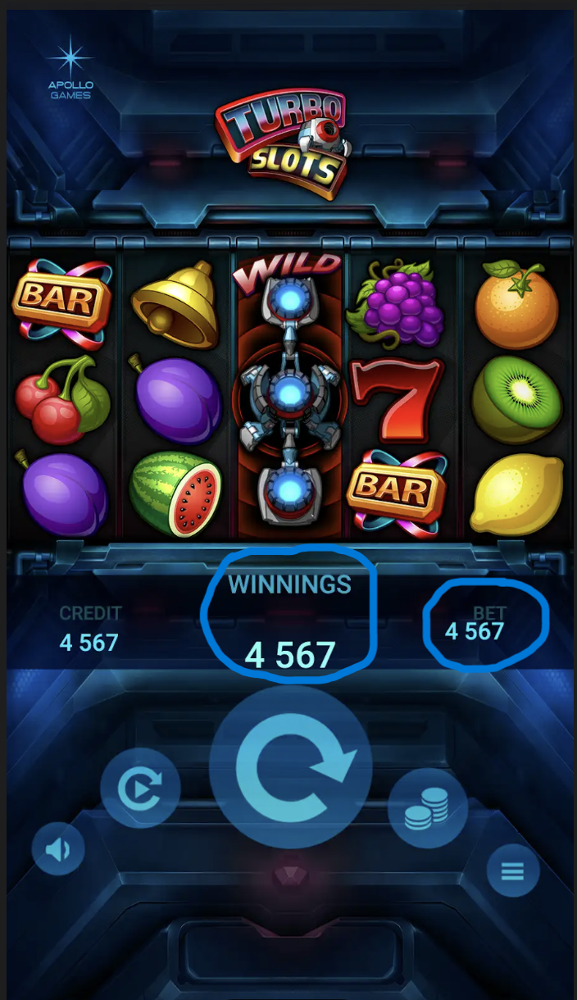

<!-- Part A - Theoretical questions -->

1. Describe a way to create multiple games from corresponding sources (code, images, sounds). What tools do you have experience with?

- I have never made a game before, but I understand the basic idea. You can create multiple games using code, images, and sounds. You write the code for the game logic, and then add images and sounds for characters, backgrounds, and effects.

I have some experience with HTML, CSS, and JavaScript, which can be used for simple web games. I have also heard about Unity and Godot, which help organize resources and make games more easily.

2.  Describe issues related to mobile device’s browsers and mobile development in general. What ways of solving such problems do you know?

- I don’t have much experience in mobile development yet, but I know some common problems.

Different screen sizes and resolutions – a website or game can look different on different phones.

Performance – mobile devices are weaker than computers, so heavy animations or scripts can run slowly.

Browser compatibility – not all features work in all mobile browsers.

Touch and gesture controls – interfaces need to work for fingers, not a mouse.

Possible solutions:

Use responsive design (CSS media queries) so the site or game adapts to different screens.

Optimize code and resources to make them run faster on weaker devices.

Test on different browsers and devices.

Use libraries or frameworks that already support mobile screens and touch controls.

3. Describe issues related to code minification and ways of solving them.

- I don’t have much experience with code minification, but I know some basic problems.

Errors after minification – sometimes the code can stop working because variable names are changed or spaces are removed.

Harder to read the code – after minification, the code becomes compact and difficult to understand or debug.

Possible solutions:

Check that the program works after minification.

Use tools like Webpack or Terser that can minify code safely.

Keep the original code readable for debugging.

4. Describe approaches to create an animation of 100 falling coins from the top edge of the screen. What pros and cons each approach has?

- I haven’t made complex animations yet, but I can think of a few ways to create an animation of 100 falling coins:

Using CSS animations

Pros: easy to implement, works in the browser without extra libraries.

Cons: hard to control each coin individually, may lag with many elements.

Using JavaScript + setInterval or requestAnimationFrame

Pros: more control over the animation, can change speed, trajectory, and other properties of each coin.

Cons: code is more complex, can be harder to optimize for 100 coins.

Using animation libraries (like GSAP)

Pros: easy to create smooth and complex animations, well optimized for many elements.

Cons: need to include an extra library, a bit harder for a beginner.

5. Describe your experience with performance optimization. Which approaches and tools did you use, if any?

- I don’t have much experience with performance optimization yet, but I know some basic approaches.

Reducing file sizes – for example, minifying code, compressing images and other resources.

Optimizing scripts – using fewer loops or heavy calculations, using requestAnimationFrame for animations instead of setInterval.

Checking performance – using browser tools (like Chrome DevTools) to profile and find problems.

I haven’t used professional optimization libraries yet, but I know they exist and can help make a website or game faster.

<!-- Part B - Practical task -->

🎮 Game Description

Game mechanics: The player must click on falling letters in time to score points. Golden letters give double points but appear less frequently.

Session duration: 20 seconds.

Interface: Minimalist design with a "Start" button to begin the game and a results screen after the session ends.

🛠️ Technical Details

Programming language: TypeScript

Framework: React

Rendering: DOM elements with absolute positioning are used to display falling letters.

Styling: CSS modules for organizing styles.

External dependencies: Minimal, only React and TypeScript.

📊 Features

Score tracking: Shows total points and the number of golden letters caught.

Score formula: total score = points + (goldenLetters \* goldenPrice)

Responsiveness: Adaptive design for various screen sizes.

<!-- Part C - Graphics -->

- I looked at the photo and marked what I don’t like in the image. The word “Winnings” and the actual winnings amount are too far apart, while the word “BET” and the bet amount are too close together.

